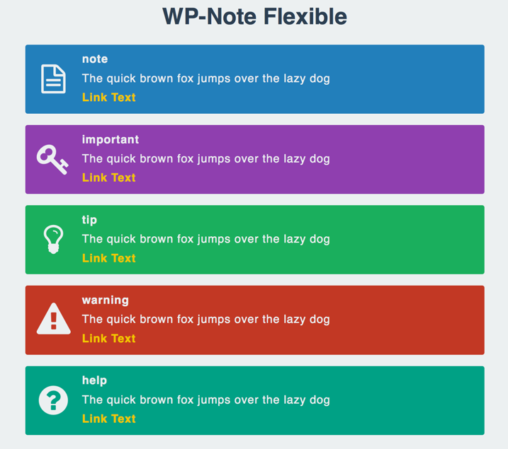

# WP-Note Flexible

[WP-Note](http://wordpress.org/plugins/wp-note/) 互換の注釈機能を提供する WordPress プラグインです。

## 使い方

1. 投稿ページを表示します
2. 注釈にしたいテキストをショートコードで囲います

プラグインの詳細については、以下のページに解説しています。

* [WP-Note Flexible - アカベコマイリ](http://akabeko.me/blog/software/wp-note-flexible/)

## スクリーンショット

### 表示サンプル

## ライセンス

* [GNU GENERAL PUBLIC LICENSE Version 2](LICENSE.txt)

## 開発情報

開発情報は Redmine で管理しています。

* [WP-Note Flexible - Redmine](http://akabeko.me/projects/projects/wp-note-flexible)
