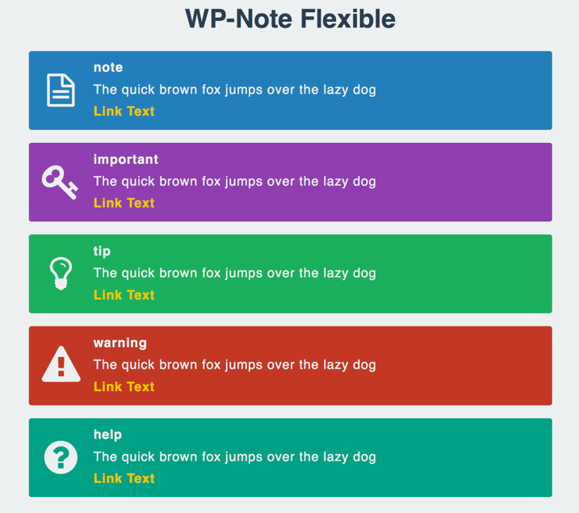

# WP-Note Flexible

It is a WordPress plug-in that provides the annotation feature of [WP-Note](http://wordpress.org/plugins/wp-note/) compatible.

## How to use

1. Show me the post page
1. Write annotation text with shortcode

More information refer to the following pages.

* [WP-Note Flexible - AKABEKOMAIRI](http://akabeko.me/blog/software/wp-note-flexible/)

## Screenshots

### Display sample

## Licence

* [GNU GENERAL PUBLIC LICENSE Version 2](LICENSE.txt)

## Development

Managed by Redmine development information.

* [WP-Note Flexible - Redmine](http://akabeko.me/projects/projects/wp-note-flexible)
